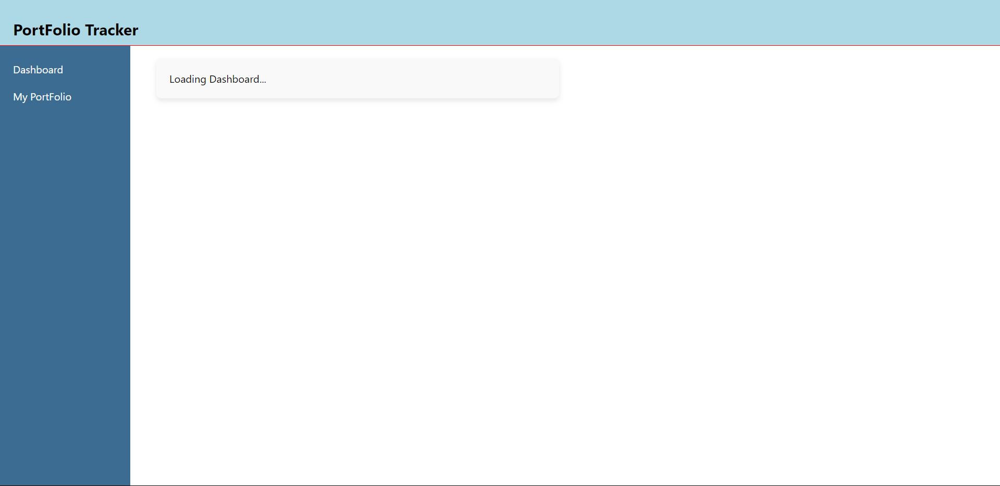
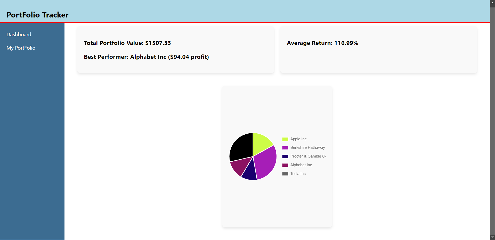
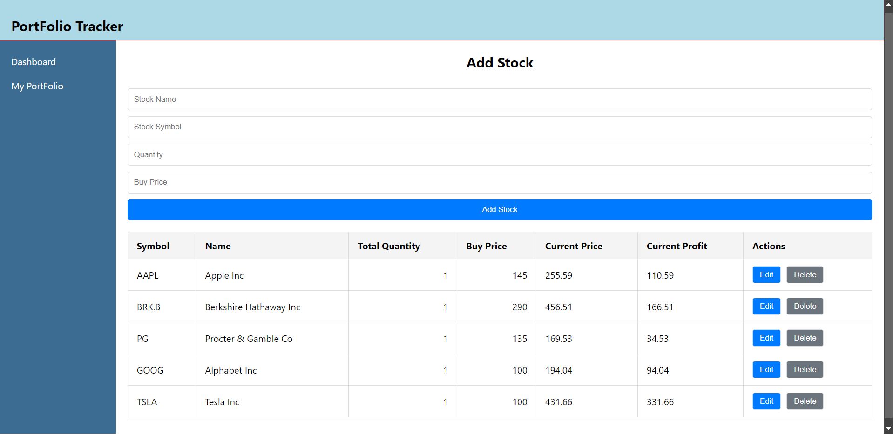
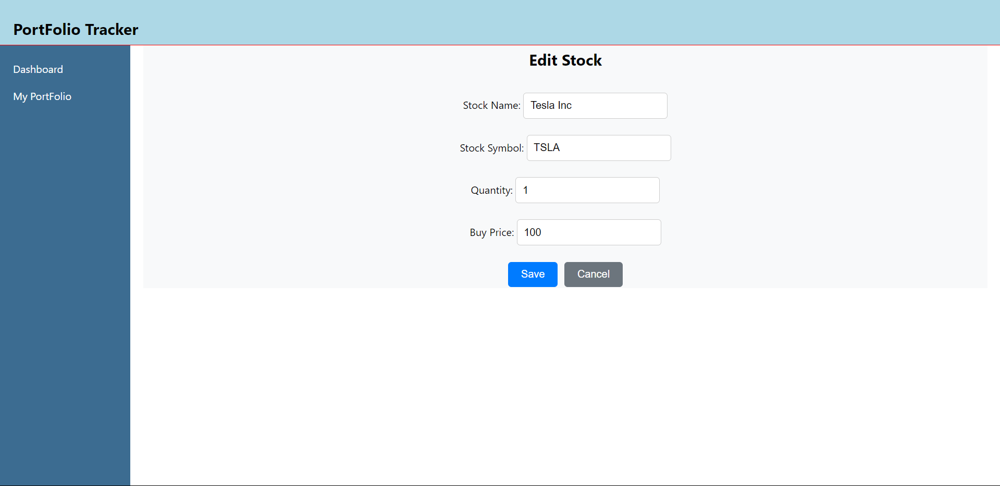

# Portfolio-Tracker-App

This provides a basic feature to track the current portfolio value and add/edit/delete the stocks, also providing live current price data.

## Constraints:

1. A user can't update the symbol once entered, as it stays as a unique identifier of the stock.
2. It enables editing of quantity, name, and buying price.
3. The buying price is not the real-time price; it's considered as historical data known by the user when adding the stock to the portfolio.

## How to Use

### To Clone the Repo:

```bash
git clone https://github.com/1ochaku/Portfolio-Tracker-App.git
```

### To Start the Server:

```bash
cd backend
npm start
```

Ensure you have registered for the **Finhubb API key** and **MongoDB database**.

### To Start the Frontend in Another Folder:

```bash
cd frontend
npm run dev
```

Since the frontend is using the API, change the **stockprovider.js API links** to the server's address before starting the frontend locally.

## Screenshots

### This is the initial page when the website is loaded and the data is being fetched.



### This is the main dashboard showing portfolio details.



### This is the my-portfolio page showing portfolio table and add stock feature.



### This is the edit page to make required changes.


